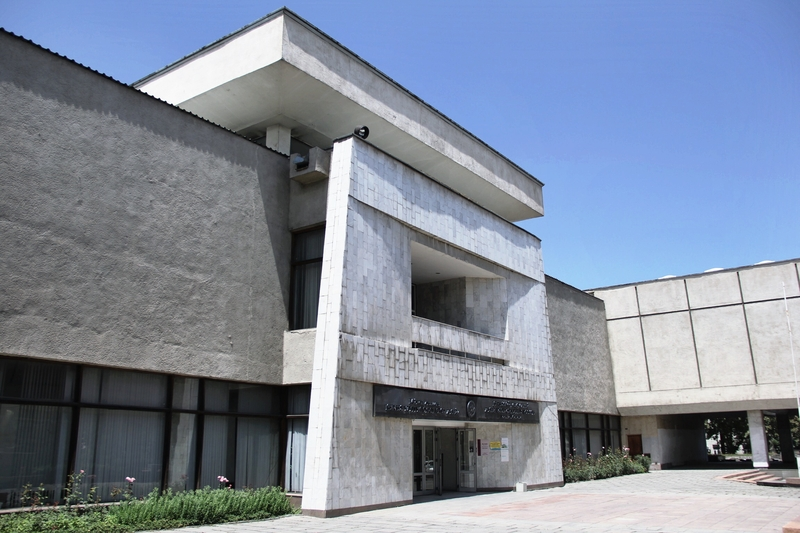
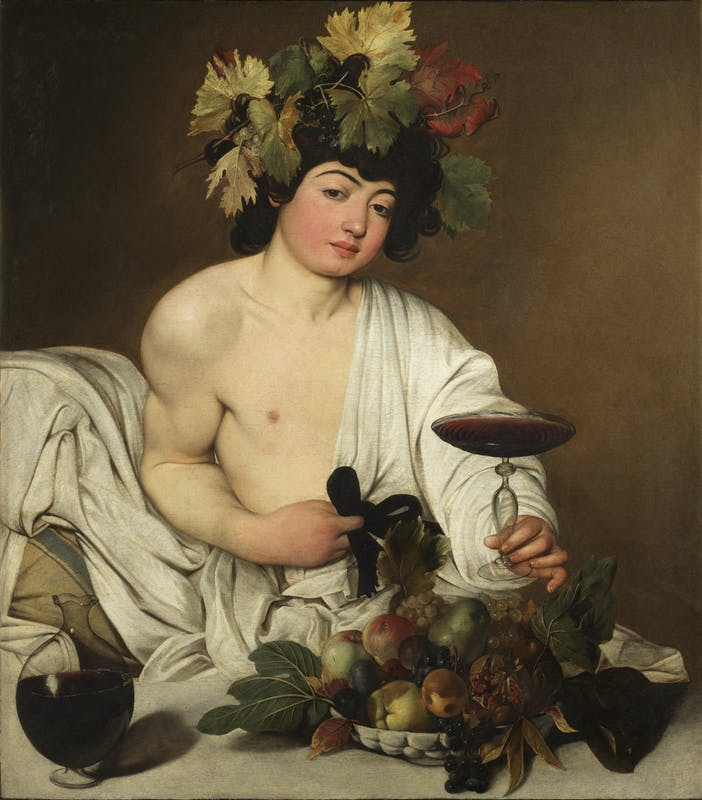
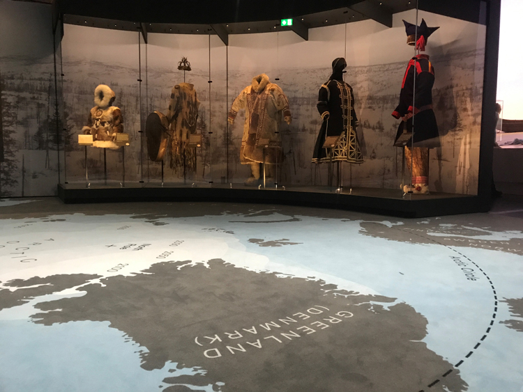

# Understanding Museums

## The Museums of Interest:

Louvre Museum – Paris, France.

The British Museum – London, England

Van Gogh Museum – Amsterdam, Netherlands

Uffizi Gallery – Florence, Italy.

National Museum of Fine Arts named after Gapar Aitiev – Bishkek, Kyrgyzstan.

### Analysis:

The four museums I toured virtually and one physically have their unique traits that are uncommon within each other. Even though the central idea of each place is the same- being there to present history through the creations of the past – the way they present or explain differs largely. Of course, there is a possible bias or a human misconception from my side as most of these virtual tours do not fully present the essence of the museum. It is to be said what I saw and my analysis can be expected to have some understanding of what makes these museums them in regards to their artworks, abundance, presentation, historical background, and information.

Artworks generally have a common situation behind them, being an item of the past or a presentation of the world before our era. Yet what type of artwork in each of our case studies has a large range of possibilities. Such as the Louvre Museum – Paris, France having all of their artwork somehow be a symbol of art. Regardless of if they are painting, sculpture, an old mask, or jewelry from the 15th century it has some belief of creativity, imagination, and art behind it. An item isn’t there just for being an old item from our history, but to be the representation of what the past made art as. While in the National Museum of Fine Arts named after Gapar Aitiev – Bishkek, Kyrgyzstan, most items are there to show the change or parts of Kyrgyz history. Excluding the replicas of old statues at the end, most of them have these paintings by Kyrgyz painters. With each of them presenting the country of Kyrgyzstan through the countryside, a bay, a city, or people talking and working. Pictures of Kyrgyz people working together, talking, and having a good time are common. The images of them in yurts in cold winters or them in fields coming back from a hard day of work. You can see how there is a clear difference between both. One advocates on the human form of expression, the art itself, while the other prompts culture and traditions as a group of humans. The British Museum – London, England, mainly concentrates on history itself. It has artifacts from all over the world, running from paintings to coins. It is there to show our history, human history. Ignoring the ways they obtained those items, the museum is there to timestamp all of the possible histories they have into one place. To show the background of all of us. The Van Gogh Museum – Amsterdam, Netherlands concentrated on one artist, Van Gosh. It is the museum which tries to show us the world a famous artist once saw. It only has paintings and all by one person. As others try to show something from a group perspective, here they show the pain, love, and history through one pair of eyes. Uffizi Gallery – Florence, Italy has a bit of a different vibe. Instead of the selective collaboration of history, they have a history all over. On the walls, roofs, grounds, and of course in enclosed cases. However, their artworks generally have this aesthetic of light academia poetry of love and prestige/elite. It looks like a work of art, the museum itself. A rich and high quality, a feeling of being thrown into the world of royalties. This museum shares the world of high greatness of the past through paintings and sculptures which were a representation or a part of that greatness.

Exploring down under, each museum has an aspect they present the most. Continuing one with the Uffizi Gallery, paintings are the most common form of artwork. They are everywhere, wherever you go. Any room there is for visitors to have a painting of high caliber. If you are trying to show the world of elites, the best way is to show who they were. Not all images are presenting royals or rich people of the past, yet they all are created to look vibrant. Looking glorious or holy. Take the painting of Bacchus, a Michelangelo Merisi, known as Caravaggio (Milano 1571 – Porto Ercole 1610), is just a painting of a god sitting around with a glass of wine and food layout for him. For a person with no knowledge of the person in the paintings, it looks like an idea of laziness. A way of seeing and not caring, but these complete rest and abandonment creates elegance. On how elegant the person seems. All of the paintings within the museum have a similar formula. A showing of a completely different levelness of anything which is part of a normal human. They present it lavishly and with high regard, making it a truly unique aspect of what they are saying. I don’t believe the fact it all looks so expensive is a bad thing, it follows the general trend of what they are. 

Bacchus, Michelangelo Merisi, known as Caravaggio (Milano 1571 – Porto Ercole 1610)

The British Museum is known to have artifacts. Ancient artifacts of all kinds, from tiny roman sculptures to remnants of tombs from Egypt. These items are all enclosed into a barrier of glass or surrounded by some barrier. There are hundreds to thousands of these, it is literally what the museum is. It is the collection of world history, wherever the British could reach, they took the history from those lands. You can see a great example at their Arctic Exhibition. A small section of their museum where they present the clothes, tools, and anything in general which were used in the Arctic. There is an explanation on the weather, the way of living/conditions of living, and what exactly they do there – including how they did it. As we have discussed before, the British Museum’s “mission” (ehem… ignoring that they stole everything) is to timestamp the world of the past. And as you can see here, they have these fully enclosed barriers, and each item is given its spotlight. The presentation of full control and assurance of safety. a way of showing their commitment to constraining the world of the before. Everything is done properly, and I believe they could not have done better and used the proper amount of abilities and power to preserve the world we would never reach. From the Louvre Museum’s collection list, their most common spotlights are drawings and engravings. These small pieces of paper have sketches, structural understanding of the larger scale paintings. I don’t know why these artworks are the most common and are pretty sure most of them are stored away however they are fundamental. The sketches are the first steps of art, a way of understanding what the final artwork may be. I think the use of these in a museum known for art shows the hard work behind all forms of art. The Van Gogh Museum obviously only has paintings generally. This ensures the world of Van Gosh through his work, excluding the influence of others. Allowing us to completely comprehend the world a man of one saw. The paintings are always spaced out in large as if seemingly making it seem too large. Bringing in this feeling of these small paintings have an influence larger than their frame. The National Museum of Fine Arts also has paintings as their most common aspect. This can be traced on as the medium most commonly used by the Kyrgyz people, the world of these people, was through paintings. There were dozens of Kyrgyz painters, all using their ways of expressing their culture and people. And the most common ones were the paintings. As one image could have shown a thousand emotions, showing a thousand details, and always explicitly state its existence. 

<a href="https://www.britishmuseum.org/exhibitions/arctic-culture-and-climate">Arctic: Culture and Climate</a>

Now talking about the historical and informative aspects of the museums, what exactly are they concentrating on. The Van Gogh Museum is the best example for this part of our analysis. The whole museum concentrated around the period when Vang Gogh was alive, which is between the 1850s to 1890s. This specific way of being within that time allows the museum to fully visualize the world of their artworks into people. There isn’t a coherent way to say this, but I think being only in this time:

- “Allows us to fully comprehend the world the museum is in. A time period we, as visitors, are thrown into completely changes how we may understand or see artworks. Concentrating on a time per section makes it much easier for us to slowly graduate between times to different regions and eras.”

Meaning, the fact these attributes create a cage for us to easily roam. The Van Gogh Museum utilizes this to make a showman of this situation. They lock us into one period, one time, to allow us to easily understand and be part of what we see. It may not seem that different or important, being there is no one else’s work is in there, when we start to look at other museums, this would show its prominence. The British Museum does not concentrate on one time period, yet each time period is given its group. The chronological order of the whole establishment allows the “smooth” transition I had mentioned earlier. If you have ever gone through Vang Gogh, you would realize how easy it is to follow through. Now bring that to multiple periods, in short bursts within a larger museum. As you have already realized, it makes a comfortable and understandable historical restoration. Both museums here utilize these facts very well. And including on, with those presentations the information sheets on each of the artwork has to have its blissfulness. You see, the placement isn’t functional if the information on the object confuses the audience. The museums mentioned have known to simply and approach a minimalistic viewpoint on their exhibits. But not only in these two, but the simplified factsheets are also seen throughout all the museums I did mention here. However, the “time” idea has been absent in two places, the National Museum of Fine Arts and the Uffizi Gallery. These two places of history do not follow a timeline to present but follow more of an aesthetical approach. Their artworks flow through how they look, what is in there and how they work with other artworks. These have no historical background formation, allowing a rather pleasing walk-through. More of a relaxation.

In conclusion, all of these museums have their unique themes. Their presentations differ by small but those differences create a large understanding of the place. I can end it here by giving what I think each museum is:

<ul>
  <li>Louvre Museum – The Art of History</li>
  <li>The British Museum – The History of History</li>
  <li>Van Gogh Museum – The history from Eyes.</li>
  <li>Uffizi Gallery – The History of Pleasing and Dreams</li>
  <li>National Museum of Fine Arts named after Gapar Aitiev – The History of Culture.</li>
</ul>
